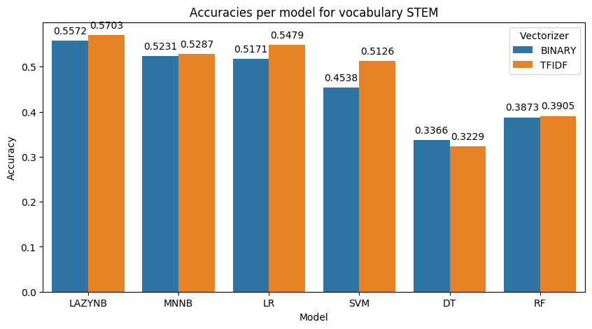
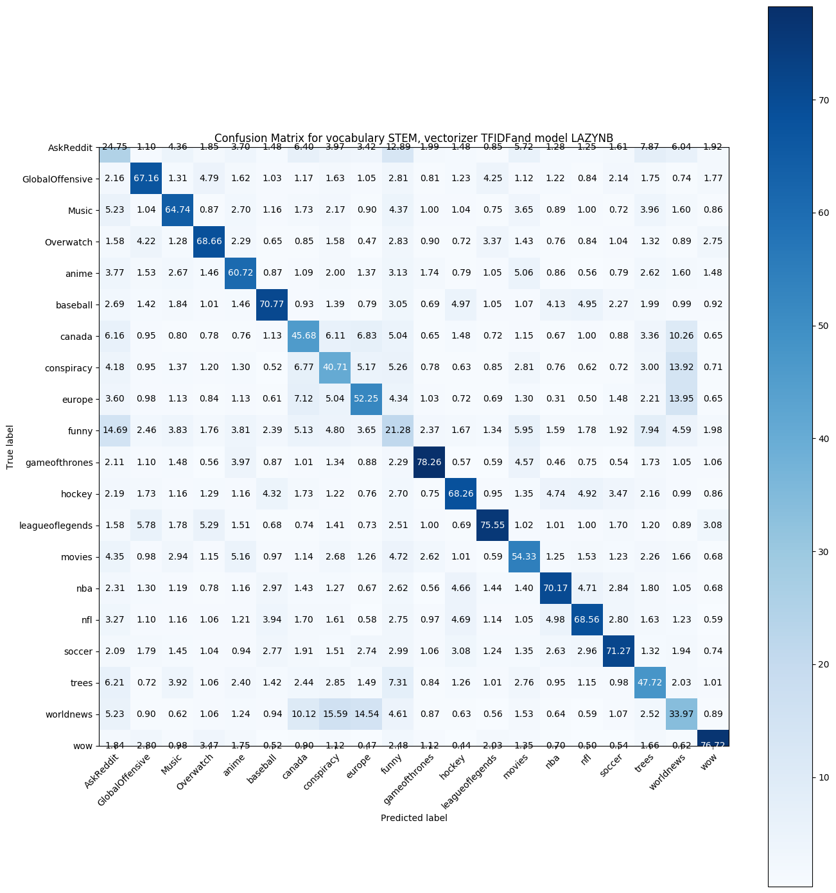

# RedditCommentTextClassification

This repository explores an implementation of text preprocessing in order to perform a multi-class classification task on reddit comments. The goal is to predict the subreddit from which a particular reddit comment comes from. The dataset contains comments from 20 different subreddits. [(Dataset here)](https://www.kaggle.com/c/reddit-comment-classification-comp-551/data)

 - 'AskReddit'
 - 'GlobalOffensive'
 - 'Music'
 - 'Overwatch'
 - 'anime'
 - 'baseball'
 - 'canada'
 - 'conspiracy'
 - 'europe'
 - 'funny'
 - 'gameofthrones'
 - 'hockey'
 - 'leagueoflegends'
 - 'movies'
 - 'nba'
 - 'nfl'
 - 'soccer'
 - 'trees'
 - 'worldnews'
 - 'wow'

## Best Results

The best results for this classification task were obtained with this preprocessing:

- Stemmed vocabulary
- Custom regex filters applied to:
  - Remap all YouTube links to a token called youtubelink
  - Remap all other links to a token called internetlink
  - Remap different smiley faces ( ;) :) :') :-) etc... ) to a common token
  - Remove tripple letters to remap words like (loool, or looooool to lol)
  - Remap years such as 20xx and 19xx to common tokens

- The Tf-Idf vectorizer to encode the data into a sparse matrix

- The custom Lazy Naive Bayes model which performs feature selection at prediction time using the ANOVA F-value score of each feature.

- An accuracy of 57.03% was obtained with a 5-fold cross validation

<table style="width:100%">
  <tr>
    <th>
      
    </th>
    <th>
      
    </th>
  </tr>
</table>

# How to run the program!

1. Download both the training data and testing data from [Kaggle](https://www.kaggle.com/c/reddit-comment-classification-comp-551/data) and place them in the ````data/raw_data directory````

</br>

2. Open the ````src/config.py```` file.
- Make sure that all data paths defined at the top of the file are correct. (They should be fine without being changed)
- In the ````vocabularies_to_run```` array, add which vocabularies you would like to test. (Possible values of "LEMMA" and "STEM")
- In the ````vectorizers_to_run```` array, add which encodings you would like to test. (Possible values of "BINARY" and "TFIDF")
- In the ````models_to_run```` array, add all the models that you want to run on all the above configurations. (Possible values of "LAZYNB", "LR", "BNB", "MNNB", "DT", "RF", "SVM")
- Modify the ````kaggle_vocab````, ````kaggle_vectorizer````, ````kaggle_model```` variables to be the configuration and model you would like to run to generate results to be submitted to kaggle.

</br>

3. Run the ````main.py```` file.
- First the ````create_vocabulary.py```` script will be ran, which preprocesses all the initial raw data to be lemmatized and stemmed. All custom regex filters are applied as well to reduce the feature space. Once the raw data is processed, it is saved into another csv file in the ````data/preprocessed_data/```` folder.
- Then the ````validation_pipeline.py```` script runs, which runs all different configurations and models that are defined in the ````config.py```` file and calculates the accuracy, confusion matrices, and saves all this data in the ````results/```` folder.
- Then finally ````generate_kaggle_results.py```` runs which: based on the submission configuration and model defined in the ````config.py```` file, predicts the test data and generates a ````predictions.csv```` file in the ````results/```` folder to be submitted to Kaggle.

Note: In step 3, the three top level scripts ````create_vocabulary.py````, ````validation_pipeline.py````, and ````generate_kaggle_results.py```` can also be ran individually as long as they are ran in this order.

## Directory Structure

````
.
├── data
│   ├── processed_data
│   │   ├── LEMMA_test_clean.csv
│   │   ├── LEMMA_train_clean.csv
│   │   ├── STEM_test_clean.csv
│   │   └── STEM_train_clean.csv
│   └── raw_data
│       ├── reddit_test.csv
│       └── reddit_train.csv
|
├── results
│   ├── predictions.csv
│   ├── results.txt
│   └── STEM_BINARY_DT_confusion.png
|
└── src
    ├── main.py
    ├── config.py
    |
    ├── create_vocabularies.py
    ├── validation_pipeline.py
    ├── generate_kaggle_results.py
    |
    ├── Data_Analysis.ipynb
    |
    ├── data_processing
    │   └── vocabulary.py
    |
    ├── models
    │   ├── LazyNaiveBayes.py
    │   ├── Model.py
    │   └── BernouilliNaiveBayes.py
    |
    └── utils
        ├── factory.py
        └── utils.py

````

The ````data/```` folder contains all raw and parsed csv files that are used for training the model and generate predictions for the Kaggle competition.

 <br />

- The ````data/raw_data/```` contains the raw data downloaded from Kaggle containing all reddit comments. (One training file and one test file)
- The ````data/processed_data/```` folder contains the csv files for the processed version of the raw data with all words either stemmed or lemmatized, custom regex filters applied to further reduce the feature space.

<br />
<br />

The ````results/```` folder is the default folder where all automatic scripts will dump all their results and figures
- The ````results.txt```` file will contain a detailed result of all the accuracies of each models ran on each configuration.
- The ````predictions.csv```` file contains the predictions generated to submit to Kaggle
- The ````*.confusion.png```` files are images of confusion matrices of each model ran on all different configurations

<br />
<br />

The ````src/```` folder contains all of the .py and .ipynb files. Python files directly in this folder are all top level scripts that can be ran.
- The ````config.py```` file is probably the **most important file** where all the configurations and models to be ran are defined as well as all the file paths of the raw data and result folder
- The ````create_vocabulary.py```` file is the script that will preprocess all the initial raw data to be lemmatized and stemmed. All custom regex filters are applied as well to reduce the feature space. Once the raw data is processed, it is saved into another csv file in the ````data/preprocessed_data/```` folder.
- The ````validation_pipeline.py```` file is a script that runs all different configurations and models that are defined in the ````config.py```` file and calculates the accuracy, confusion matrices, and saves all this data in the ````results/```` folder.
- The ````generate_kaggle_results.py```` file is a script that: based on the submission configuration and model defined in the ````config.py```` file, predicts the test data and generates a ````predictions.csv```` file in the ````results/```` folder to be submitted to kaggle.
- The ````main.py```` script will run all three previously described scripts in order: create_vocabulary, validation_pipeline, generate_kaggle_results.

<br />

- The ````Data_Analysis.ipynb```` is a jupyter notebook that performs an overall data analysis of the raw data to determine what kind of words are common in which subreddits etc...

- The ````data_processing/vocabulary.py```` file contains all helper functions that clean up the initial raw data by lemmatizing it, applying custom regex filters etc...

- The ````models/```` directory contains a *from scratch* implementation of Bernoulli Naive Bayes and a Lazy implementation of Naive Bayes using the MultinomialNB model from Sklearn.

- The ````utils/factory.py```` file contains all functions to get instances of models and vectorizers based on the trying keywords defines in the ````config.py```` file.

- The ````utils/utils.py```` file contains all I/O utility functions to save, load csv files, save immages etc...
